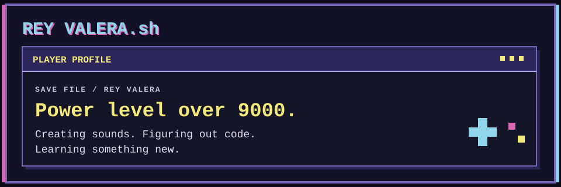
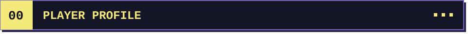
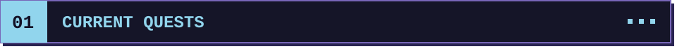
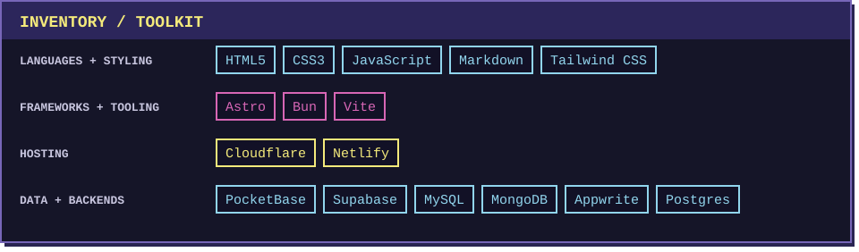
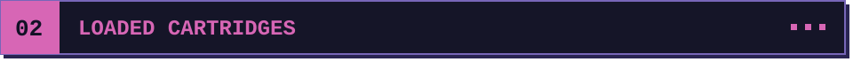
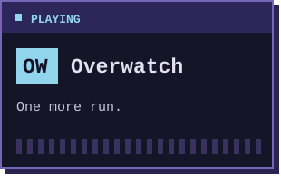
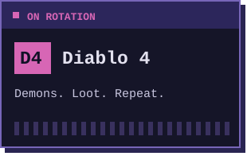
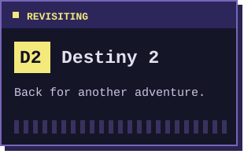
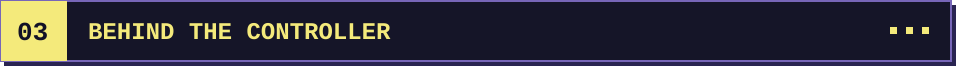
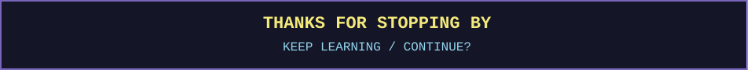

<code>AUDIO EXPLORER</code> &nbsp; <code>SELF-TAUGHT CODER</code> &nbsp; <code>DAD</code>

  <a href="#current-quests">01 / Work</a> &nbsp; · &nbsp;
  <a href="#loaded-cartridges">02 / Games</a> &nbsp; · &nbsp;
  <a href="#behind-the-controller">03 / Life</a>

## 

Hi, I’m **Rey** — a self-taught developer and lifelong learner from **New York**. I code and learn for fun, building little tools and exploring ideas along the way.

> **SAVE FILE / REY VALERA** 
> `CODE` Always learning &nbsp; · &nbsp; `SOUND` Aspiring audio engineer &nbsp; · &nbsp; `LIFE` Dad & gamer

## 

| `QUEST 01 · SOUND` | `QUEST 02 · CODE` |
| :--- | :--- |
| **From the studio** | **Things I’m building** |
| Exploring mixes, recordings, and “what if I tried this?” experiments. | Little tools, side projects, and lessons learned along the way. |

## 

`GAMES IN ROTATION / 3 SLOTS`

  
  
  

## 

Outside of code and the studio, I’m a dad. Always learning, always creating, and making room for a little bit of gaming.

> `SIDE QUESTS` Family time · Sound experiments · A little gaming

## 

  <a href="https://reyvalera.com"><strong>VISIT MY WORLD ↗</strong></a> &nbsp; · &nbsp;
  <a href="https://discord.gg/JVegsscZ"><strong>DISCORD ↗</strong></a> &nbsp; · &nbsp;
  <a href="https://steamcommunity.com/profiles/76561198236226660"><strong>STEAM ↗</strong></a>

